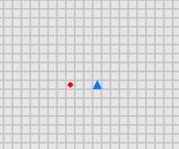
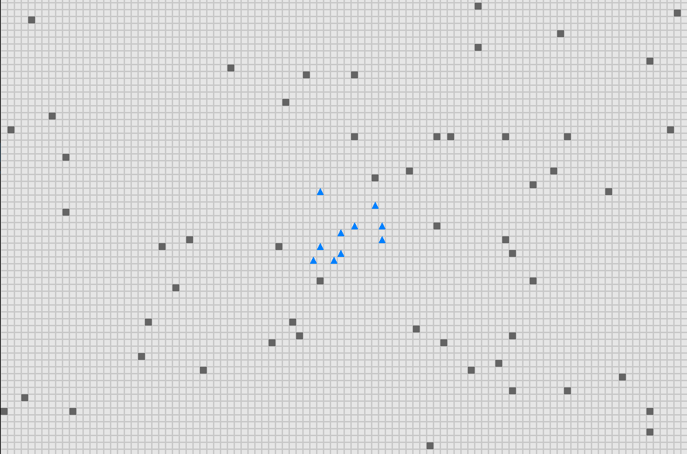
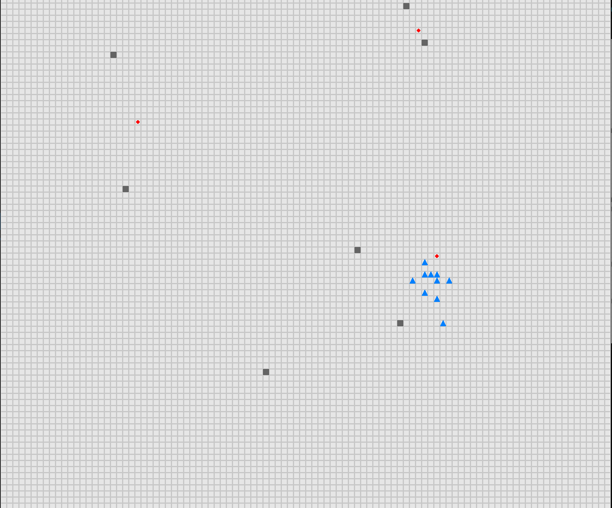

# Distributed UAV Swarm Formation Control via Object-Focused, Multi-Objective SARSA

## Overview
This project is an implementation of the paper:

**"Distributed UAV Swarm Formation Control via Object-Focused, Multi-Objective SARSA"**
by **Christian Speck and Donald J. Bucci** (Spectrum Systems Lab, Lockheed Martin Advanced Technology Labs)

The approach introduces a modular **State-Action-Reward-State-Action (SARSA)** reinforcement learning framework for **decentralized UAV swarm formation control**. The methodology applies **multi-objective reinforcement learning** with **object-focused learning** to optimize swarm behavior while avoiding obstacles and reaching waypoints efficiently.

### Implementation Details
- The UAV agents are trained using **OF-GM-SARSA** for different behavioral modules:
  - **Reynolds flocking**
  - **Target seeking**
  - **Obstacle avoidance**
- A **greatest mass approach** is applied for action selection, where UAVs select the heading that maximizes the weighted sum of Q-values across all Q-tables.
- Training is conducted in **three phases** to optimize learning efficiency and generalization across different scenarios.

## Setup & Installation

1. Clone the repository:
   ```bash
   git clone <repository_url>
   cd <repository_folder>
   ```
2. Install dependencies:
   ```bash
   pip install -r requirements.txt
   ```
3. Run training with a specified configuration file:
   ```bash
   python train.py <config_file>
   ```

## Training Phases
Training is conducted in **three phases** to progressively optimize UAV swarm behavior:

### Phase 1: Target Seeking
- A **single UAV** learns to move towards a randomly placed waypoint in an environment **without obstacles**.
- The UAV optimizes its policy for waypoint navigation.

**Example:** 

### Phase 2: Obstacle Avoidance & Flocking
- A **fixed set of UAVs** is introduced.
- Agents learn **Reynolds flocking** and **obstacle avoidance**.
- Obstacle positions are randomized.

**Example:** 

### Phase 3: Full Swarm Integration
- All **five objectives** (flocking, target seeking, and obstacle avoidance) are combined.
- A randomly placed, **fixed-size swarm** moves toward a single waypoint while avoiding a random number of obstacles.

**Example:** 


## Training Configurations
- Training configurations and training Q-tables are stored in the `results/` folder.
- Example testing configurations are in the `configs/` folder.

## Citation
If you use this implementation, please cite the original paper:

Speck, C., & Bucci, D. J. (Year). Distributed UAV Swarm Formation Control via Object-Focused, Multi-Objective SARSA. *Spectrum Systems Lab, Lockheed Martin Advanced Technology Labs.*

BibTeX:
```bibtex
@article{speck2023sarsa,
  author    = {Christian Speck and Donald J. Bucci},
  title     = {Distributed UAV Swarm Formation Control via Object-Focused, Multi-Objective SARSA},
  journal   = {Spectrum Systems Lab},
  year      = {2023},
}
```

## License
This project is licensed under the **MIT License**.

---

For any questions or contributions, feel free to open an issue or submit a pull request!

